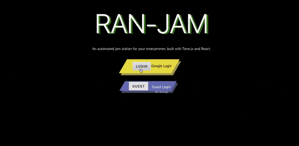
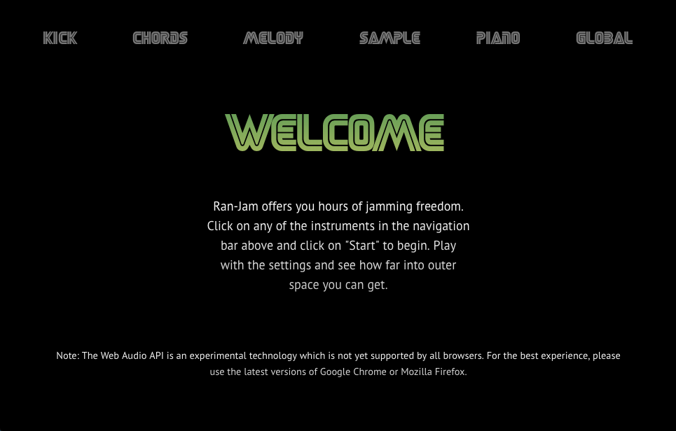

# Ran-Jam

## Synopsis
A full-stack web app built with React, Node.js, Express.js, MongoDB, and Tone.js that allows users to jam along with randomly created music. Users can also log into the app using Google oAuth to save their own musical jams.

## Features
- Ability to save songs
- Pulls samples from the FreeSound API
- Each experience is different with the generative element
- Plenty of options to change the instrument to fit the user's needs

## Challenges
- My first project using MongoDB, it was hard to get my head wrapped around how get it set up using mLab etc
- Having to keep things separated to avoid confusion proved difficult at times
- The ability to record piano performances never happened

## Node Dependancies
- [tone](https://yarnpkg.com/en/package/tone)
- [react](https://yarnpkg.com/en/package/react)
- [body-parser](https://yarnpkg.com/en/package/body-parser) 
- [rc-slider](https://yarnpkg.com/en/package/rc-slider)
- [dotenv](https://yarnpkg.com/en/package/dotenv)
- [express](https://yarnpkg.com/en/package/express)
- [halogenium](https://yarnpkg.com/en/package/halogenium)
- [helmet](https://yarnpkg.com/en/package/helmet)
- [mongoose](https://yarnpkg.com/en/package/mongoose)
- [morgan](https://yarnpkg.com/en/package/morgan)

